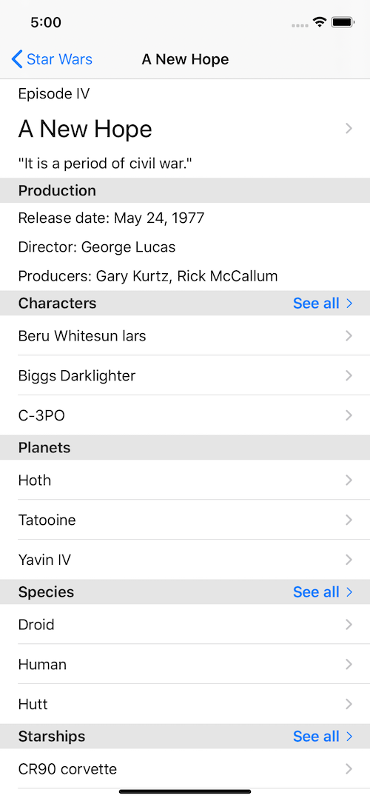

# Star Wars Reader

The Star Wars Reader is a demo app/learning exercise that uses SwiftUI and Combine to browse a dataset of _Star Wars_ information.

## Architectural Highlights

- The networking components of the app use Combine to make requests for network resources.
  - The main data fetcher utilizes the new `dataTaskPublisher` method that returns a publisher to deliver results of the network request rather than a callback closure (i.e., `dataTask(with:completionHandler:)`).
  - Additional methods are chained to this publisher to return publishers that deliver data structures parsed from this data.

- The interface is built entirely using SwiftUI, which lends itself nicely to MVVM patterns and mock data sources for testing while you are developing.

- The data for the app is read from [SWAPI](https://swapi.co), the Star Wars API, using GraphQL via the [SWAPI GraphQL Wrapper](https://github.com/graphql/swapi-graphql).

## Screenshot

## Credits

- [Paul Hallet](https://github.com/phalt)
- [The Star Wars API](https://swapi.co) | [GitHub](https://github.com/phalt/swapi)
- [GraphQL Foundation](https://graphql.org) | [GitHub](https://github.com/graphql)
